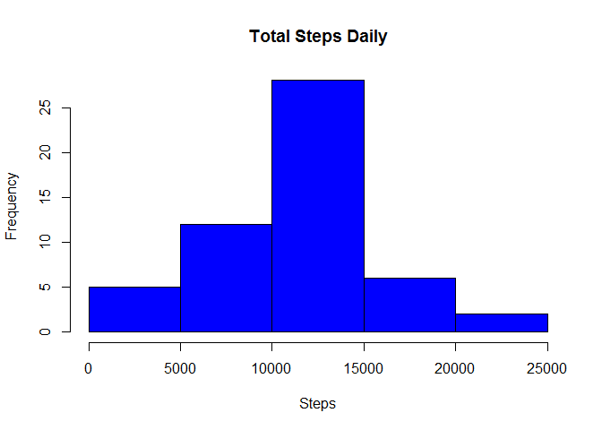
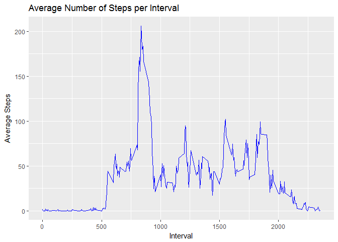
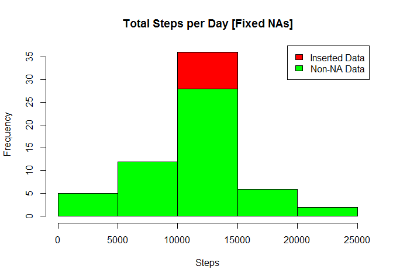
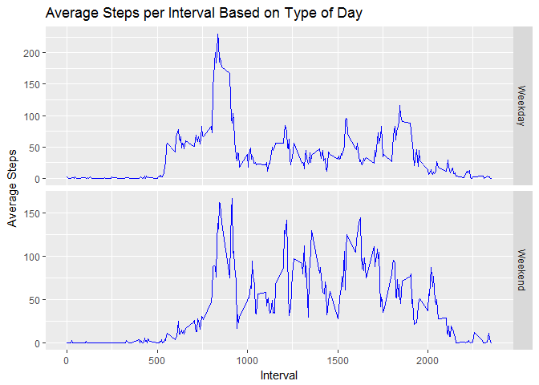

Introduction
------------

It is now possible to collect a large amount of data about personal
movement using activity monitoring devices such as a Fitbit, Nike
Fuelband, or Jawbone Up. These type of devices are part of the
"quantified self" movement - a group of enthusiasts who take
measurements about themselves regularly to improve their health, to find
patterns in their behavior, or because they are tech geeks. But these
data remain under-utilized both because the raw data are hard to obtain
and there is a lack of statistical methods and software for processing
and interpreting the data.

This assignment makes use of data from a personal activity monitoring
device. This device collects data at 5 minute intervals through out the
day. The data consists of two months of data from an anonymous
individual collected during the months of October and November, 2012 and
include the number of steps taken in 5 minute intervals each day.

The data for this assignment can be downloaded from the course web site:

-   Dataset: [Activity monitoring
    data](https://d396qusza40orc.cloudfront.net/repdata%2Fdata%2Factivity.zip)
    \[52K\]

The variables included in this dataset are:

-   steps: Number of steps taking in a 5-minute interval (missing values
    are coded as NA)  
-   date: The date on which the measurement was taken in YYYY-MM-DD
    format  
-   interval: Identifier for the 5-minute interval in which measurement
    was taken

The dataset is stored in a comma-separated-value (CSV) file and there
are a total of 17,568 observations in this dataset.

### Loading and Preprocessing the Data

    library(dplyr)

    ## 
    ## Attaching package: 'dplyr'

    ## The following objects are masked from 'package:stats':
    ## 
    ##     filter, lag

    ## The following objects are masked from 'package:base':
    ## 
    ##     intersect, setdiff, setequal, union

    library(ggplot2)
    # unzip(zipfile = "actiity.zip")
    data <- read.csv("activity.csv")
    # summary(data)
    cleanData <- filter(data, !is.na(data$steps))

### What is mean total number of steps taken per day?

1.  Remove missing dates with no steps taken from the data set. Compute
    for total number of steps taken per day.

<!-- -->

    totalspd <- summarise(group_by(cleanData, date), Tsteps = sum(steps))

1.  Create the historgram for the total number of steps taken per day

<!-- -->

    hist(totalspd$Tsteps, breaks = 5, col = "blue", xlab = "Steps", main = "Total Steps Daily")

1.  Calculate the mean and the median for the total steps taken daily.

<!-- -->

    meantspd <- as.integer(mean(totalspd$Tsteps))  
    mediantspd <- median(totalspd$Tsteps)

Average number of steps taken daily : 10766  
Median number of steps taken daily : 10765

What is the average dadily activity pattern?
--------------------------------------------

1.  Make a time series plot (i.e. type = "l") of the 5-minute
    interval (x-axis) and the average number of steps taken, averaged
    across all days (y-axis).

<!-- -->

    spI <- summarise(group_by(cleanData, interval), steps = mean(steps))
    dailyp <- ggplot(spI, aes(x=interval, y=steps))
    dailyp+geom_line(color="blue")+xlab("Interval")+ylab("Average Steps")+ggtitle("Average Number of Steps per Interval")

1.  Which 5-minute interval, on average across all the days in the
    dataset, contains the maximum number of steps?

<!-- -->

    maxS <- as.integer(max(spI$steps))
    maxInt <- spI[spI$steps==max(spI$steps),1]

Maximum number of steps for a 5 minute interval : 206  
5 minute interval with the maximum number of steps : 835

Imputing missing values
-----------------------

1.  Calculate and report the total number of missing values in the
    dataset (i.e. the total number of rows with NAs)

<!-- -->

    nullRows <- nrow(data[is.na(data$steps),])

Total number of rows with NA value : 2304

1.  Devise a strategy for filling in all of the missing values in
    the dataset. The strategy does not need to be sophisticated. For
    example, you could use the mean/median for that day, or the mean for
    that 5-minute interval, etc.

-   Fill NAs with the mean steps for each intervals

<!-- -->

    naData <- data[is.na(data$steps),]
    naData$steps[is.na(naData$steps)] <- spI$steps[match(naData$interval, spI$interval)][which(is.na(naData$steps))]
    mergeData <- rbind(cleanData, naData)
    totalspd2 <- summarise(group_by(mergeData, date), Tsteps2 = sum(steps))
    hist(totalspd2$Tsteps2, breaks = 5, col = "red", xlab="Steps", main="Total Steps per Day [Fixed NAs]")
    hist(totalspd$Tsteps, breaks = 5, col = "green",  add=T)
    legend("topright", c("Inserted Data", "Non-NA Data"), fill=c("red", "Green") )

    newMean <- as.integer(mean(totalspd2$Tsteps2))
    varMean <- newMean - meantspd
    newMedian <- as.integer(median(totalspd2$Tsteps2))
    varMed <- newMedian - mediantspd

New mean of inserted data : 10766; vs original mean 10766 resulting to a
variance of 0 average steps daly.

New median of inserted data : 10766; vs original mean 10765 resulting to
a variance of 1 steps for the median.

No real observable change for both histogram, median and mean.

Are there differences in activity patterns between weekdays and weekends?
-------------------------------------------------------------------------

1.  Create a new factor variable in the dataset with two levels -
    "weekday" and "weekend" indicating whether a given date is a weekday
    or weekend day.

<!-- -->

    mergeData$day <- weekdays(as.Date(mergeData$date))
    mergeData$dayCat <- ifelse(mergeData$day %in% c("Saturday", "Sunday"), "Weekend", "Weekday")
    spI2 <- summarise(group_by(mergeData, interval, dayCat), steps = mean(steps))
    dailyp2 <- ggplot(spI2, aes(x=interval, y=steps))
    dailyp2+geom_line(color="blue")+facet_grid(dayCat~., scales = "free")+xlab("Interval")+ylab("Average Steps")+ggtitle("Average Steps per Interval Based on Type of Day")

There is an observable trend based on what day within the week the
activity is done. Average steps taken seems to be higher over the
weekend.
